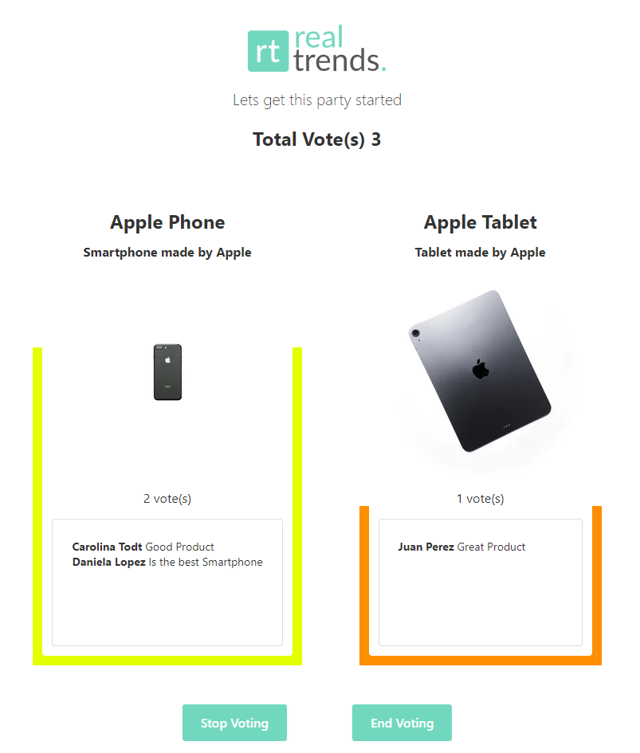

# RealTrends challenge
Se debe crear una aplicación de votación realtime.

## API
* [x] Debe exponer un servidor de websocket al que se pueda subscribir.
* [x] Debe emitir eventos cuando haya votos nuevos.[x]


## Cliente
* [x] Debe haber al menos dos productos sobre los cuales se pueda votar. 
* [x] Se debe mostrar un indicador del porcentaje de votos de cada producto.
* [x] Se debe poder ver quienes fueron los votantes y sus respectivas valoraciónes.
* [x] Cada usuario puede votar una vez, si vota más de una, el voto se transfiere.

## Definiciones técnicas
* [x] El código de la aplicación debe estar subida a un repositorio de público acceso.

## Puntos extra
* El usuario puede seleccionar los productos desde el cliente viendo un modal con productos de Mercado Libre.
* [x] La votación se puede pausar, reanudar y reiniciar desde el cliente.

## Resultados del desarrollo



## Correr el proyecto
```bash
## Instalar las dependencias del proyecto
npm install

## Instalar las dependencias de los paquetes
npm run bootstrap

## Correr los paquetes
npm run dev
```
